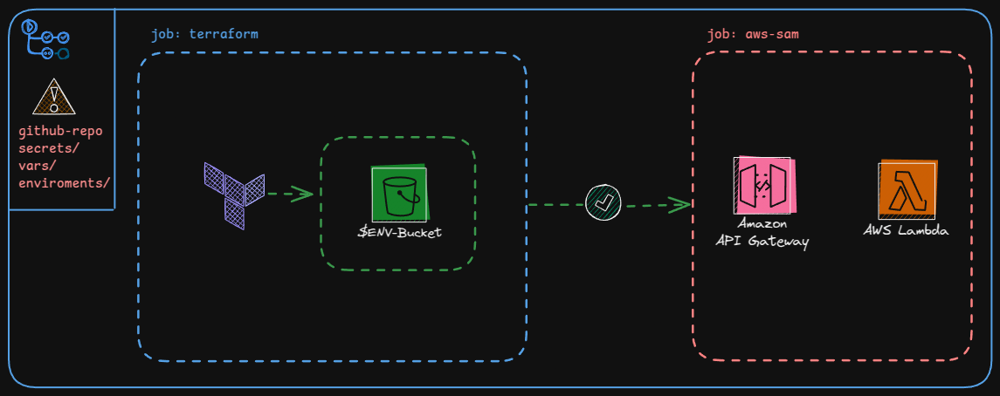

# Projeto: Pipeline com AWS SAM, Terraform e GitHub Actions

Este repositório é um projeto de aprendizado que tem como finalidade implementar uma pipeline de infraestrutura como código (IaC) utilizando Terraform, AWS SAM e GitHub Actions. O objetivo é explorar conceitos como automação de CI/CD, gerenciamento de ambientes, uso de secrets e environments do GitHub, e integração com AWS.

O projeto consiste em um workflow simples que utiliza o Terraform para criar buckets no Amazon S3 de forma dinâmica, adaptando-se ao ambiente (como dev ou prod) e aplicando configurações específicas conforme o branch onde o código é editado e commitado. Após a conclusão bem-sucedida do deploy via Terraform, o workflow executa uma etapa subsequente que implanta um API Gateway integrado a uma função Lambda.

# Visão Geral

O projeto consiste em uma pipeline automatizada que:

1. Valida e aplica configurações do Terraform em diferentes ambientes (dev e prod).

2. Utiliza GitHub Actions para orquestrar o fluxo de trabalho.

3. Aproveita secrets do GitHub para gerenciar credenciais sensíveis.

4. Usa environments do GitHub para separar e gerenciar ambientes de implantação.

5. Após a conclusão bem-sucedida do job do Terraform, o workflow avança para a próxima etapa: a implantação de um API Gateway integrado a uma função Lambda, expandindo os recursos provisionados com uma interface de API funcional.
6. Implementa boas práticas como validação de código, automação de deploy e controle de acesso.

## Funcionalidades Principais

1. **Pipeline com GitHub Actions**:
   - O workflow é acionado por push nas branches `develop` e `main`.
   - Define dinamicamente o ambiente (`dev` ou `prod`) com base na branch.
   - Utiliza a API do GitHub para validar os environments configurados no repositório.

2. **Terraform como IaC**:
   - Define infraestrutura como código usando Terraform.
   - Utiliza o backend remoto do terraform em um bucket do s3
   - Utiliza variáveis de ambiente (`TF_VAR_*`) para configurar ambientes dinamicamente.

3. **Gerenciamento de Secrets**:
   - Credenciais sensíveis (como chaves da AWS) são armazenadas em **secrets** do GitHub.
   - O workflow assume uma role na AWS usando OIDC (OpenID Connect) para autenticação segura.

4. **Environments do GitHub**:
   - Ambientes (`dev` e `prod`) são configurados no repositório para separar implantações.
   - O workflow valida se o ambiente existe antes de prosseguir.

5. **Automação de Deploy**:
   - Aplica automaticamente as mudanças no ambiente correto com base na branch.
   - Valida o código Terraform antes de aplicar as mudanças.

## Como Funciona o Workflow

1. **Trigger**:
   - O workflow é acionado por push nas branches `develop` e `main`.

2. **Definição do Ambiente**:
   - O ambiente (`dev` ou `prod`) é definido dinamicamente com base na branch.

3. **Autenticação na AWS**:
   - O GitHub Actions assume uma role na AWS usando OIDC.

4. **1º Job - Terraform**:
   - O código Terraform é validado antes da aplicação.
   - Caso não haja erros é feito o deploy do terraform e o segundo job do aws-sam se inicia
5. **2º Job - AWS SAM**
    - Após a finalização do deploy do Terraform, o workflow inicia a construção (build) e implantação (deploy) dos recursos definidos no AWS Serverless Application Model (SAM).
   - Esse processo garante a criação e atualização dos componentes da aplicação serverless, como funções Lambda, API Gateway e permissões associadas.

6. **Aplicação ou Destruição**:
   - O workflow aplica as mudanças no ambiente correto.
   - Opcionalmente, destrói recursos com base na configuração em `destroy/destroy_config.json`.